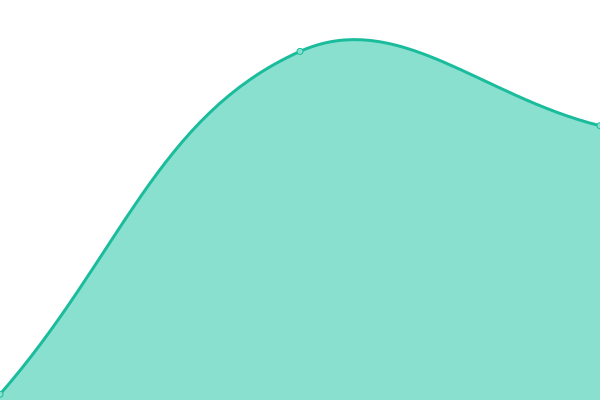

# [📈 Live Status](https://status.owlstake.com): <!--live status--> **🟧 Partial outage**

This repository contains the open-source uptime monitor and status page for [owlstake.com](https://owlstake.com), powered by [Upptime](https://github.com/upptime/upptime).

With [Upptime](https://upptime.js.org), you can get your own unlimited and free uptime monitor and status page, powered entirely by a GitHub repository. We use [Issues](https://github.com/owlstake/uptime-status/issues) as incident reports, [Actions](https://github.com/owlstake/uptime-status/actions) as uptime monitors, and [Pages](https://status.owlstake.com) for the status page.

<!--start: status pages-->
<!-- This summary is generated by Upptime (https://github.com/upptime/upptime) -->
<!-- Do not edit this manually, your changes will be overwritten -->
<!-- prettier-ignore -->
| URL | Status | History | Response Time | Uptime |
| --- | ------ | ------- | ------------- | ------ |
|  [Homepage https://owlstake.com](https://owlstake.com) | 🟩 Up | [homepage-https-owlstake-com.yml](https://github.com/owlstake/uptime-status/commits/HEAD/history/homepage-https-owlstake-com.yml) | 

 120ms
     
 | 

<a href="https://status.owlstake.com/history/homepage-https-owlstake-com">100.00%</a>
    

|  [Explorer https://explorer.owlstake.com](https://explorer.owlstake.com) | 🟩 Up | [explorer-https-explorer-owlstake-com.yml](https://github.com/owlstake/uptime-status/commits/HEAD/history/explorer-https-explorer-owlstake-com.yml) | 

 70ms
     
 | 

<a href="https://status.owlstake.com/history/explorer-https-explorer-owlstake-com">100.00%</a>
    

|  [Services https://services.owlstake.com](https://services.owlstake.com) | 🟥 Down | [services-https-services-owlstake-com.yml](https://github.com/owlstake/uptime-status/commits/HEAD/history/services-https-services-owlstake-com.yml) | 

 61ms
     
 | 

<a href="https://status.owlstake.com/history/services-https-services-owlstake-com">0.00%</a>
    

|  [Monitoring https://tenderduty.owlstake.com](https://tenderduty.owlstake.com) | 🟥 Down | [monitoring-https-tenderduty-owlstake-com.yml](https://github.com/owlstake/uptime-status/commits/HEAD/history/monitoring-https-tenderduty-owlstake-com.yml) | 

 100ms
     
 | 

<a href="https://status.owlstake.com/history/monitoring-https-tenderduty-owlstake-com">0.00%</a>
    

|  [Snapshots https://snapshots.owlstake.com](https://snapshots.owlstake.com) | 🟥 Down | [snapshots-https-snapshots-owlstake-com.yml](https://github.com/owlstake/uptime-status/commits/HEAD/history/snapshots-https-snapshots-owlstake-com.yml) | 

 39ms
     
 | 

<a href="https://status.owlstake.com/history/snapshots-https-snapshots-owlstake-com">0.00%</a>
    

<!--end: status pages-->

[**Visit our status website →**](https://status.owlstake.com)

## 📄 License

- Powered by: [Upptime](https://github.com/upptime/upptime)
- Code: [MIT](./LICENSE) © [owlstake.com](https://owlstake.com)
- Data in the `./history` directory: [Open Database License](https://opendatacommons.org/licenses/odbl/1-0/)
