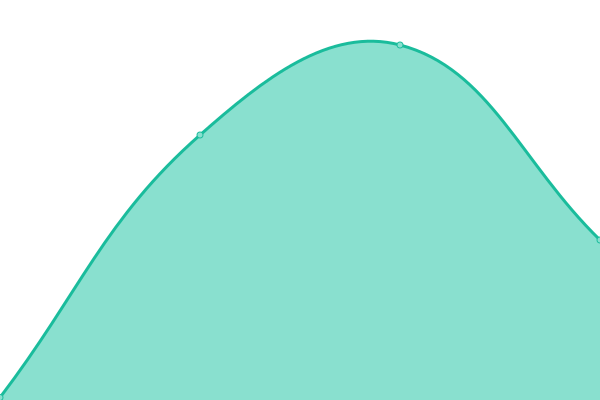
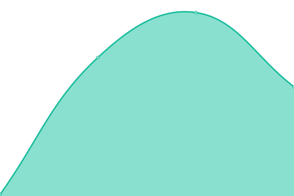

# [📈 Live Status](https://status.owlstake.com): <!--live status--> **🟧 Partial outage**

This repository contains the open-source uptime monitor and status page for [owlstake.com](https://owlstake.com), powered by [Upptime](https://github.com/upptime/upptime).

With [Upptime](https://upptime.js.org), you can get your own unlimited and free uptime monitor and status page, powered entirely by a GitHub repository. We use [Issues](https://github.com/owlstake/uptime-status/issues) as incident reports, [Actions](https://github.com/owlstake/uptime-status/actions) as uptime monitors, and [Pages](https://status.owlstake.com) for the status page.

<!--start: status pages-->
<!-- This summary is generated by Upptime (https://github.com/upptime/upptime) -->
<!-- Do not edit this manually, your changes will be overwritten -->
<!-- prettier-ignore -->
| URL | Status | History | Response Time | Uptime |
| --- | ------ | ------- | ------------- | ------ |
|  [Homepage](https://owlstake.com) | 🟩 Up | [homepage.yml](https://github.com/owlstake/uptime-status/commits/HEAD/history/homepage.yml) | 

 60ms
     
 | 

<a href="https://status.owlstake.com/history/homepage">100.00%</a>
    

|  [Explorer](https://explorer.owlstake.com) | 🟩 Up | [explorer.yml](https://github.com/owlstake/uptime-status/commits/HEAD/history/explorer.yml) | 

 128ms
     
 | 

<a href="https://status.owlstake.com/history/explorer">100.00%</a>
    

|  [Services](https://services.owlstake.com) | 🟥 Down | [services.yml](https://github.com/owlstake/uptime-status/commits/HEAD/history/services.yml) | 

 106ms
     
 | 

<a href="https://status.owlstake.com/history/services">0.00%</a>
    

|  [Monitoring](https://tenderduty.owlstake.com) | 🟥 Down | [monitoring.yml](https://github.com/owlstake/uptime-status/commits/HEAD/history/monitoring.yml) | 

 99ms
     
 | 

<a href="https://status.owlstake.com/history/monitoring">2.26%</a>
    

|  [Snapshots](https://snapshots.owlstake.com) | 🟥 Down | [snapshots.yml](https://github.com/owlstake/uptime-status/commits/HEAD/history/snapshots.yml) | 

 32ms
     
 | 

<a href="https://status.owlstake.com/history/snapshots">6.82%</a>
    

<!--end: status pages-->

[**Visit our status website →**](https://status.owlstake.com)

## 📄 License

- Powered by: [Upptime](https://github.com/upptime/upptime)
- Code: [MIT](./LICENSE) © [owlstake.com](https://owlstake.com)
- Data in the `./history` directory: [Open Database License](https://opendatacommons.org/licenses/odbl/1-0/)
