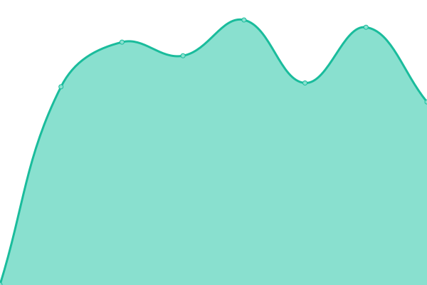

# [📈 Live Status](https://status.owlstake.com): <!--live status--> **🟧 Partial outage**

This repository contains the open-source uptime monitor and status page for [owlstake.com](https://owlstake.com), powered by [Upptime](https://github.com/upptime/upptime).

With [Upptime](https://upptime.js.org), you can get your own unlimited and free uptime monitor and status page, powered entirely by a GitHub repository. We use [Issues](https://github.com/owlstake/uptime-status/issues) as incident reports, [Actions](https://github.com/owlstake/uptime-status/actions) as uptime monitors, and [Pages](https://status.owlstake.com) for the status page.

<!--start: status pages-->
<!-- This summary is generated by Upptime (https://github.com/upptime/upptime) -->
<!-- Do not edit this manually, your changes will be overwritten -->
<!-- prettier-ignore -->
| URL | Status | History | Response Time | Uptime |
| --- | ------ | ------- | ------------- | ------ |
|  [Homepage](https://owlstake.com) | 🟩 Up | [homepage.yml](https://github.com/owlstake/uptime-status/commits/HEAD/history/homepage.yml) | 

 220ms
     
 | 

<a href="https://status.owlstake.com/history/homepage">100.00%</a>
    

|  [Explorer](https://explorer.owlstake.com) | 🟩 Up | [explorer.yml](https://github.com/owlstake/uptime-status/commits/HEAD/history/explorer.yml) | 

 162ms
     
 | 

<a href="https://status.owlstake.com/history/explorer">100.00%</a>
    

|  [Shentu RPC](https://shentu-rpc.owlstake.com) | 🟩 Up | [shentu-rpc.yml](https://github.com/owlstake/uptime-status/commits/HEAD/history/shentu-rpc.yml) | 

 1052ms
     
 | 

<a href="https://status.owlstake.com/history/shentu-rpc">99.31%</a>
    

|  [Shentu API](https://shentu-api.owlstake.com) | 🟩 Up | [shentu-api.yml](https://github.com/owlstake/uptime-status/commits/HEAD/history/shentu-api.yml) | 

 1317ms
     
 | 

<a href="https://status.owlstake.com/history/shentu-api">98.67%</a>
    

|  [Aura RPC](https://aura_6322-2-rpc.owlstake.com) | 🟩 Up | [aura-rpc.yml](https://github.com/owlstake/uptime-status/commits/HEAD/history/aura-rpc.yml) | 

 1101ms
     
 | 

<a href="https://status.owlstake.com/history/aura-rpc">99.31%</a>
    

|  [Aura API](https://aura_6322-2-api.owlstake.com) | 🟥 Down | [aura-api.yml](https://github.com/owlstake/uptime-status/commits/HEAD/history/aura-api.yml) | 

 1809ms
     
 | 

<a href="https://status.owlstake.com/history/aura-api">92.76%</a>
    

|  [Atom-1 RPC](https://atomone-1-rpc.owlstake.com) | 🟩 Up | [atom-1-rpc.yml](https://github.com/owlstake/uptime-status/commits/HEAD/history/atom-1-rpc.yml) | 

 889ms
     
 | 

<a href="https://status.owlstake.com/history/atom-1-rpc">99.31%</a>
    

|  [Atom-1 API](https://atomone-1-api.owlstake.com) | 🟩 Up | [atom-1-api.yml](https://github.com/owlstake/uptime-status/commits/HEAD/history/atom-1-api.yml) | 

 1086ms
     
 | 

<a href="https://status.owlstake.com/history/atom-1-api">99.31%</a>
    

|  [Dymension RPC](https://dymension_1100-1-rpc.owlstake.com) | 🟩 Up | [dymension-rpc.yml](https://github.com/owlstake/uptime-status/commits/HEAD/history/dymension-rpc.yml) | 

 1898ms
     
 | 

<a href="https://status.owlstake.com/history/dymension-rpc">47.97%</a>
    

|  [Dymension API](https://dymension_1100-1-api.owlstake.com) | 🟩 Up | [dymension-api.yml](https://github.com/owlstake/uptime-status/commits/HEAD/history/dymension-api.yml) | 

 3409ms
     
 | 

<a href="https://status.owlstake.com/history/dymension-api">44.91%</a>
    

|  [Saga RPC](https://ssc-1-rpc.owlstake.com) | 🟩 Up | [saga-rpc.yml](https://github.com/owlstake/uptime-status/commits/HEAD/history/saga-rpc.yml) | 

 2581ms
     
 | 

<a href="https://status.owlstake.com/history/saga-rpc">47.87%</a>
    

|  [Saga API](https://ssc-1-api.owlstake.com) | 🟩 Up | [saga-api.yml](https://github.com/owlstake/uptime-status/commits/HEAD/history/saga-api.yml) | 

 2091ms
     
 | 

<a href="https://status.owlstake.com/history/saga-api">47.70%</a>
    

|  [Seda RPC](https://seda-1-rpc.owlstake.com) | 🟩 Up | [seda-rpc.yml](https://github.com/owlstake/uptime-status/commits/HEAD/history/seda-rpc.yml) | 

 1532ms
     
 | 

<a href="https://status.owlstake.com/history/seda-rpc">98.22%</a>
    

|  [Seda API](https://seda-1-api.owlstake.com) | 🟩 Up | [seda-api.yml](https://github.com/owlstake/uptime-status/commits/HEAD/history/seda-api.yml) | 

 1637ms
     
 | 

<a href="https://status.owlstake.com/history/seda-api">98.23%</a>
    

|  [Pell Testnet RPC](https://ignite_186-1-rpc.owlstake.com) | 🟥 Down | [pell-testnet-rpc.yml](https://github.com/owlstake/uptime-status/commits/HEAD/history/pell-testnet-rpc.yml) | 

 2215ms
     
 | 

<a href="https://status.owlstake.com/history/pell-testnet-rpc">0.00%</a>
    

|  [Pell Testnet API](https://ignite_186-1-api.owlstake.com) | 🟥 Down | [pell-testnet-api.yml](https://github.com/owlstake/uptime-status/commits/HEAD/history/pell-testnet-api.yml) | 

 2221ms
     
 | 

<a href="https://status.owlstake.com/history/pell-testnet-api">0.00%</a>
    

|  [Seda Testnet RPC](https://seda-1-testnet-rpc.owlstake.com) | 🟩 Up | [seda-testnet-rpc.yml](https://github.com/owlstake/uptime-status/commits/HEAD/history/seda-testnet-rpc.yml) | 

 1145ms
     
 | 

<a href="https://status.owlstake.com/history/seda-testnet-rpc">98.15%</a>
    

|  [Seda Testnet API](https://seda-1-testnet-api.owlstake.com) | 🟩 Up | [seda-testnet-api.yml](https://github.com/owlstake/uptime-status/commits/HEAD/history/seda-testnet-api.yml) | 

 1167ms
     
 | 

<a href="https://status.owlstake.com/history/seda-testnet-api">98.15%</a>
    

<!--end: status pages-->

[**Visit our status website →**](https://status.owlstake.com)

## 📄 License

- Powered by: [Upptime](https://github.com/upptime/upptime)
- Code: [MIT](./LICENSE) © [owlstake.com](https://owlstake.com)
- Data in the `./history` directory: [Open Database License](https://opendatacommons.org/licenses/odbl/1-0/)
